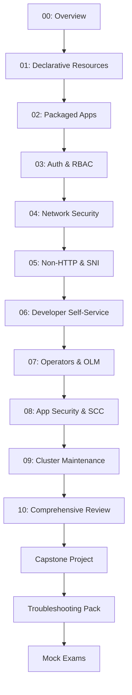

# OpenShift 4.x Administration & Operations Course

## Assumed Defaults (Used Throughout Course)

```bash
export CLUSTER_API="api.ocp4.example.com:6443"
export APPS_DOMAIN="apps.ocp4.example.com"
export REGISTRY="quay.io/myorg"
export NS="demo"
export STORAGECLASS="gp3-csi"  # Auto-detected if not set
export CHANNEL="stable-4.14"
export IDP_NAME="htpasswd"
export ADMIN_USER="admin"
export DEV_USER="developer"
```

## Audience

- **OpenShift Administrators** managing OCP 4.x clusters
- **SREs** responsible for platform reliability and operations
- **Platform Engineers** building self-service infrastructure
- **DevOps Engineers** deploying and troubleshooting workloads
- **RHCE/EX280 certification** candidates

## Course Goals

1. Master declarative resource management with `oc apply` and Kustomize
2. Deploy packaged apps using Templates, Helm, and ImageStreams
3. Configure authentication providers and RBAC with confidence
4. Secure applications with Routes, NetworkPolicies, and SCCs
5. Enable developer self-service with quotas, limits, and project templates
6. Operate Operators via OLM (install, upgrade, troubleshoot)
7. Perform cluster maintenance: upgrades, node drains, backups
8. Troubleshoot common Day-2 issues using systematic triage

## How to Practice

**DANGER**: Never practice cluster upgrades or destructive `oc adm` commands on production clusters. Use sandbox/dev environments only.

### Safe Practice Environment Options

```bash
# Option 1: CRC (CodeReady Containers) - Single-node local cluster
crc setup
crc start
eval $(crc oc-env)
oc login -u developer https://api.crc.testing:6443

# Option 2: ROSA Trial (AWS) - Managed OCP cluster
rosa create cluster --cluster-name=training --region=us-east-1

# Option 3: OpenShift Sandbox (free developer account)
# Visit https://developers.redhat.com/developer-sandbox
```

**Verify** environment is ready:

```bash
oc version
oc cluster-info
oc get nodes
oc get clusterversion
```

Output should show OCP 4.x version, healthy nodes, and cluster accessible.

## Environment Prep

```bash
# Install CLI tools
curl -LO https://mirror.openshift.com/pub/openshift-v4/clients/ocp/stable/openshift-client-linux.tar.gz
tar xvf openshift-client-linux.tar.gz
sudo mv oc kubectl /usr/local/bin/
oc version --client

# Install Helm 3
curl https://raw.githubusercontent.com/helm/helm/main/scripts/get-helm-3 | bash
helm version

# Install Kustomize
curl -s "https://raw.githubusercontent.com/kubernetes-sigs/kustomize/master/hack/install_kustomize.sh" | bash
sudo mv kustomize /usr/local/bin/
kustomize version

# Login to cluster
oc login ${CLUSTER_API} -u ${ADMIN_USER} -p ${PASSWORD}
```

**Verify** tools installed:

```bash
oc version && helm version && kustomize version
```

All three tools should report version numbers.

## Module Map



## Course Structure

- **10 Modules** (each 30-45 min with hands-on lab)
- **Capstone Project** (FoodCart microservices with dev/prod overlays)
- **Troubleshooting Pack** (triage matrix for common issues)
- **Cheatsheets** (oc CLI, YAML snippets, oc adm ops)
- **2 Mock Exams** (60 min each, with solutions)

## Learning Path

1. Read module goals and key terms
2. Copy-paste commands into your cluster
3. Complete the mini-lab (5-10 min)
4. Take the quiz (5 questions)
5. Review common mistakes
6. Bookmark troubleshooting links

## CLI-First Philosophy

This course prioritizes command-line operations over GUI. The OpenShift web console is powerful but not always available (CI/CD, automation, exams). All tasks use `oc`, `kubectl`, `helm`, `oc adm`, and `opm` commands.

## Time Commitment

- **Self-paced**: 12-15 hours (modules + labs)
- **Capstone**: 2-3 hours (deploy, test, troubleshoot)
- **Exams**: 2 hours (practice under time pressure)

## Prerequisites

- Linux command line proficiency
- Basic Kubernetes concepts (Pods, Deployments, Services)
- YAML syntax familiarity
- Git basics

## Ready to Start?

Proceed to **[Module 01: Declarative Resource Management](01-declarative-resource-management.md)** to begin hands-on learning.

## Quick Reference Links

- [Troubleshooting Triage Matrix](../troubleshooting/triage-matrix.md)
- [oc CLI Cheatsheet](../cheatsheets/oc-cli.md)
- [YAML Snippets](../cheatsheets/yaml-snippets.md)
- [oc adm Operations](../cheatsheets/oc-adm-ops.md)
- [Capstone Project](../project/README.md)
