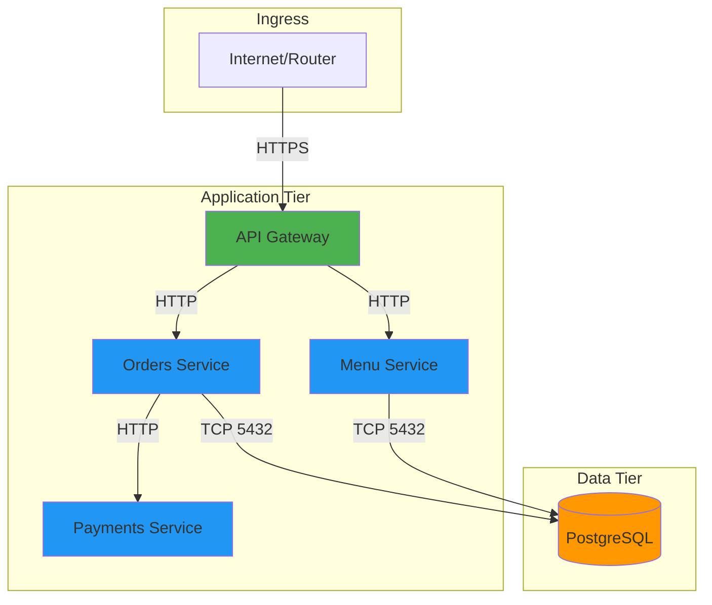

# Capstone Project: FoodCart Microservices on OpenShift

## Overview

Deploy a **FoodCart** application with 5 microservices using Kustomize overlays for dev and prod environments. Implement all security controls learned: NetworkPolicies, SCCs, Routes, Quotas, HPA, PDB, Secrets, ConfigMaps, and PVCs.

## Architecture



## Services

1. **API Gateway** (`gateway`): Routes traffic, HTTPS termination
2. **Menu Service** (`menu`): Returns food menu (stateless)
3. **Orders Service** (`orders`): Manages orders, writes to DB
4. **Payments Service** (`payments`): Processes payments (simulated)
5. **PostgreSQL** (`db`): Persistent database

## Environment Comparison

| Feature | Dev | Prod |
|---------|-----|------|
| **Replicas** | 1 per service | 2-3 per service (HPA) |
| **Routes** | HTTP | HTTPS (edge termination) |
| **Database** | In-cluster StatefulSet | External DB (simulated) |
| **Resources** | Low (256Mi/100m CPU) | High (1Gi/500m CPU) |
| **Probes** | Basic liveness | Liveness + readiness + startup |
| **PDB** | None | minAvailable=1 |
| **NetworkPolicy** | Allow all | Default-deny + selective allow |
| **SCC** | restricted | restricted |
| **Storage** | emptyDir | PVC (ReadWriteOnce) |

## Prerequisites

```bash
# Set environment variables
export NS_DEV="foodcart-dev"
export NS_PROD="foodcart-prod"
export APPS_DOMAIN="apps.ocp4.example.com"

# Ensure cluster access
oc whoami
oc version
```

## Quick Deploy

```bash
# Dev environment
oc new-project ${NS_DEV}
oc apply -k overlays/dev

# Prod environment
oc new-project ${NS_PROD}
oc apply -k overlays/prod

# Verify
oc get all,route,networkpolicy,pvc -n ${NS_DEV}
oc get all,route,networkpolicy,pvc -n ${NS_PROD}
```

## Directory Structure

```
project/
├── README.md
├── manifests/
│   ├── base/
│   │   ├── kustomization.yaml
│   │   ├── gateway-deployment.yaml
│   │   ├── menu-deployment.yaml
│   │   ├── orders-deployment.yaml
│   │   ├── payments-deployment.yaml
│   │   ├── db-statefulset.yaml
│   │   ├── services.yaml
│   │   ├── configmap.yaml
│   │   └── secret.yaml
│   └── overlays/
│       ├── dev/
│       │   ├── kustomization.yaml
│       │   ├── route.yaml
│       │   └── namespace.yaml
│       └── prod/
│           ├── kustomization.yaml
│           ├── route.yaml
│           ├── namespace.yaml
│           ├── hpa.yaml
│           ├── pdb.yaml
│           ├── networkpolicies.yaml
│           └── resource-patch.yaml
├── scripts/
│   ├── smoke-test.sh
│   ├── load-test.sh
│   ├── seed-data.sh
│   └── failure-injection.sh
└── runbook.md
```

## Step-by-Step Deployment

### 1. Deploy Dev Environment

```bash
oc new-project ${NS_DEV}

# Apply base + dev overlay
oc apply -k overlays/dev

# Wait for pods to be ready
oc wait --for=condition=ready pod -l app=foodcart -n ${NS_DEV} --timeout=300s

# Get Route URL
DEV_URL=$(oc get route gateway -n ${NS_DEV} -o jsonpath='{.spec.host}')
echo "Dev URL: http://${DEV_URL}"
```

### 2. Seed Test Data

```bash
# Run seed script
./scripts/seed-data.sh ${NS_DEV}

# Verify data
oc exec -n ${NS_DEV} deployment/orders -- curl -s http://menu:8080/api/menu
```

### 3. Run Smoke Tests

```bash
./scripts/smoke-test.sh ${NS_DEV}
```

Expected output:
```
✓ Gateway accessible
✓ Menu service returns items
✓ Orders service accepts order
✓ Payments service processes payment
✓ Database connectivity OK
```

### 4. Deploy Prod Environment

```bash
oc new-project ${NS_PROD}

# Apply base + prod overlay
oc apply -k overlays/prod

# Wait for pods
oc wait --for=condition=ready pod -l app=foodcart -n ${NS_PROD} --timeout=300s

# Get Route URL (HTTPS)
PROD_URL=$(oc get route gateway -n ${NS_PROD} -o jsonpath='{.spec.host}')
echo "Prod URL: https://${PROD_URL}"
```

### 5. Verify Prod Security

```bash
# Check NetworkPolicies applied
oc get networkpolicy -n ${NS_PROD}

# Verify HPA configured
oc get hpa -n ${NS_PROD}

# Check PDB exists
oc get pdb -n ${NS_PROD}

# Verify TLS Route
curl -I -k https://${PROD_URL}
```

### 6. Run Load Test

```bash
./scripts/load-test.sh ${NS_PROD}

# Watch HPA scale up
oc get hpa -n ${NS_PROD} -w
```

## Failure Injection & Recovery

### Scenario 1: Pod Crash

```bash
# Inject failure
./scripts/failure-injection.sh pod-crash ${NS_PROD} orders

# Observe recovery
oc get pods -n ${NS_PROD} -l service=orders -w
# Kubernetes restarts pod automatically

# Verify service availability
curl -s https://${PROD_URL}/api/orders | jq '.status'
# Should still return 200 OK (other replicas serve traffic)
```

### Scenario 2: DNS Failure (NetworkPolicy block)

```bash
# Block DNS egress
./scripts/failure-injection.sh block-dns ${NS_PROD}

# Observe symptoms
oc logs -n ${NS_PROD} deployment/orders | grep -i "name resolution"

# Fix: Apply DNS egress policy
oc apply -f - <<EOF
apiVersion: networking.k8s.io/v1
kind: NetworkPolicy
metadata:
  name: allow-dns
  namespace: ${NS_PROD}
spec:
  podSelector: {}
  policyTypes:
  - Egress
  egress:
  - to:
    - namespaceSelector:
        matchLabels:
          kubernetes.io/metadata.name: openshift-dns
    ports:
    - protocol: UDP
      port: 53
EOF

# Verify recovery
oc rollout restart deployment/orders -n ${NS_PROD}
```

### Scenario 3: Database Connection Failure

```bash
# Scale DB to 0 replicas
oc scale statefulset/db --replicas=0 -n ${NS_PROD}

# Observe errors
oc logs -n ${NS_PROD} deployment/orders | grep -i "database"

# Restore DB
oc scale statefulset/db --replicas=1 -n ${NS_PROD}

# Verify recovery
oc wait --for=condition=ready pod -l app=db -n ${NS_PROD} --timeout=120s
```

### Scenario 4: SCC Violation

```bash
# Inject SCC violation (attempt to run as root)
oc patch deployment orders -n ${NS_PROD} --type=merge -p '
{
  "spec": {
    "template": {
      "spec": {
        "containers": [{
          "name": "orders",
          "securityContext": {
            "runAsUser": 0
          }
        }]
      }
    }
  }
}'

# Observe failure
oc get pods -n ${NS_PROD} -l service=orders
oc describe pod -n ${NS_PROD} -l service=orders | grep -i scc

# Fix: Revert change or grant anyuid SCC
oc rollout undo deployment/orders -n ${NS_PROD}
```

## Monitoring & Observability

```bash
# Resource usage
oc adm top pods -n ${NS_PROD}
oc adm top nodes

# Application logs
oc logs -f deployment/gateway -n ${NS_PROD}
oc logs -f deployment/orders -n ${NS_PROD}

# Events (troubleshooting)
oc get events -n ${NS_PROD} --sort-by='.lastTimestamp'

# Describe resources
oc describe deployment orders -n ${NS_PROD}
oc describe hpa orders-hpa -n ${NS_PROD}
```

## Teardown

```bash
# Delete dev environment
oc delete project ${NS_DEV}

# Delete prod environment
oc delete project ${NS_PROD}
```

## Success Criteria

- [ ] Dev environment deploys with HTTP route
- [ ] Prod environment deploys with HTTPS route
- [ ] All services communicate successfully
- [ ] Database persists data (PVC bound)
- [ ] NetworkPolicies restrict traffic in prod
- [ ] HPA scales replicas under load
- [ ] PDB prevents disruption during drain
- [ ] Smoke tests pass in both environments
- [ ] Failure injection scenarios recoverable
- [ ] All pods use restricted SCC

## Learning Objectives Achieved

✅ Declarative resource management (Kustomize overlays)  
✅ Packaged app deployment (Helm-like structure)  
✅ RBAC and authentication (ServiceAccounts)  
✅ Network security (Routes, NetworkPolicies)  
✅ Service exposure (ClusterIP, Route)  
✅ Developer self-service (Quotas, Limits in overlays)  
✅ Application security (Secrets, SCCs, SecurityContext)  
✅ High availability (HPA, PDB, multi-replica)  
✅ Persistent storage (PVC for database)  
✅ Troubleshooting (failure injection & recovery)

## Next Steps

1. Review [Runbook](runbook.md) for SRE playbooks
2. Customize overlays for staging environment
3. Integrate with GitOps (ArgoCD, Flux)
4. Add Prometheus metrics endpoints
5. Implement distributed tracing (Jaeger)

## References

- [Kustomize Documentation](https://kustomize.io/)
- [OpenShift Routes](https://docs.openshift.com/container-platform/latest/networking/routes/route-configuration.html)
- [NetworkPolicy Recipes](https://github.com/ahmetb/kubernetes-network-policy-recipes)
- [HPA Best Practices](https://docs.openshift.com/container-platform/latest/nodes/pods/nodes-pods-autoscaling.html)
- [Troubleshooting Matrix](../troubleshooting/triage-matrix.md)
